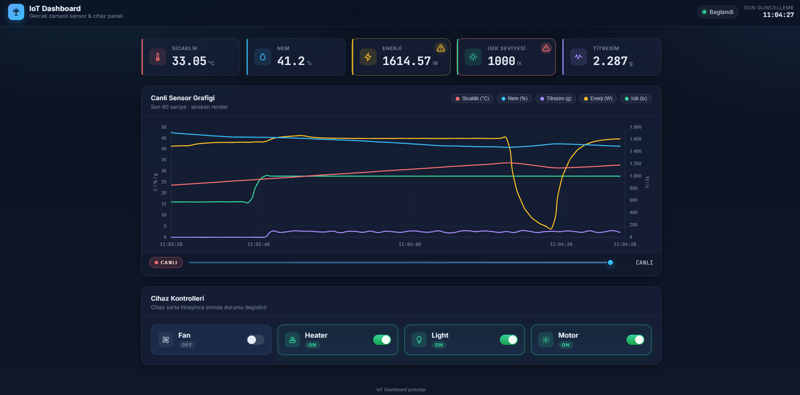

# Smart Room Dashboard

> Fiziksel donanim olmadan calisan, gercek-zamanli bir IoT sistemini bastan
> sona modelleyen prototip dashboard. Sensor uretimi, REST API, canli
> grafiklerle web arayuzu ve cihaz kontrolunu tek surec icinde sergiler.


---

## Onizleme



---

## Hakkinda

Bu proje, IoT sistemlerini ogrenmek/anlatmak icin hazirlanmis bir
**referans uygulamadir**. Gercek bir akilli oda senaryosunu — sensor
okumalari, cihaz kontrolu, canli izleme — fiziksel donanim ihtiyaci
olmadan, sadece Python ve modern web teknolojileriyle modellemeyi amaclar.

5 sensor (sicaklik, nem, enerji, isik, titresim) ve 4 cihaz (fan, heater,
light, motor) icerir. Cihaz durumlari sensor okumalarini **fiziksel olarak
mantikli** sekilde etkiler: heater acilinca sicaklik tirmanir ve nem
duser, motor acilinca titresim sicrar, light gunes egrisinden de
beslenerek 800 lx hedefine yumusakca ramp eder.

---

## Mimari

```
+----------------------+        +----------------------------+
|  Browser (UI)        |        |  Flask process :1453       |
|  HTML / CSS / JS     | <----> |  REST endpoints (routes)   |
|  Chart.js (CDN)      |        |  Thread-safe state (RLock) |
|  Live charts +       |        |  Simulator daemon thread   |
|  Time scrubber       |        |    (1 Hz tick)             |
+----------------------+        +----------------------------+
        ^                                    |
        |  GET /api/data (1 Hz polling)      |
        |  POST /api/control (toggle)        v
        +-------- HTTP / JSON --------> sensor_state
```

**Tek surec, tek port, sifir bagimlilik kompleksligi.** Backend ana
thread'i HTTP isteklerini servis eder; daemon thread her saniye state'i
gunceller. Iki thread arasi senkronizasyon `RLock` ile saglanir — okuma
ve yazma sirasinda race condition yok.

---

## Ozellikler

### Backend
- 1 Hz tick periyoduyla **fiziksel olarak tutarli sensor uretimi**
  (Clausius-Clapeyron yaklasimi ile heater→nem dusumu, ambient drift,
  saat-bazli gunes lumeni)
- Thread-safe state yonetimi (`threading.RLock`)
- 6 REST endpoint (health, data, history, control GET/POST, dashboard)
- Validation: hatali cihaz/state isteklerine `400` + aciklayici JSON

### Frontend
- 5 metrigi **iki Y ekseninde** tek grafikte gosterim (sicaklik/nem/
  titresim solda, enerji/isik sagda)
- Chart.js Bezier yumusatma (`tension: 0.55`) ile akiskan, kirilmasiz cizgi
- 30 fps render dongusu — backend 1 Hz olsa bile grafik akiskan akar
- **Esik bazli uyari sistemi**: yanip sonen ikon + ozel CSS tooltip
- **Slider scrubber**: son 30 dakikalik veride gecmise donus
- iOS-tarzi switch ile cihaz kontrolu, anlik UI feedback
- Responsive tasarim (mobil/tablet/desktop)

### Sektor karsiligi
- Home Assistant tarzi smart-home dashboard'larin minimal versiyonu
- SCADA / endustriyel goruntuleme sistemlerinin egitim modeli
- Predictive maintenance (titresim tabanli) icin baslangic noktasi

---

## Cihaz Davranis Matrisi

| Cihaz   | Sicaklik | Nem    | Isik | Titresim | Enerji  |
|---------|----------|--------|------|----------|---------|
| Heater  | ↑↑↑      | ↓↓     | —    | —        | +1500W  |
| Fan     | —        | denge ↑↑ | —  | —        | +50W    |
| Light   | ↑ (cuzi) | —      | ↑↑↑ | —        | +12W    |
| Motor   | ↑ (cuzi) | —      | —    | ↑↑↑      | +100W   |

**Onemli noktalar:**
- **Fan tek basina sicakligi DUSURMEZ** (gercek fizik: fan havayi
  karistirir, sogutmaz). Sadece dengeleme hizini 2× yapar.
- **Heater + Fan birlikte ısınmayı surdurur** — fan iptal etmez.
- **Tum OFF**: degerler 22 °C / %50 RH ortam dengesine doner.

---

## Uyari Esikleri

| Metrik     | Uyari (sari) | Kritik (kirmizi) | Sensor sinirlari |
|------------|--------------|------------------|------------------|
| Sicaklik   | ≥38 / ≤14 °C | ≥42 / ≤11 °C    | 10–45 °C         |
| Nem        | ≥80 / ≤28 %  | ≥87 / ≤23 %     | 20–90 %          |
| Enerji     | ≥1500 W      | ≥1700 W         | (max ~1667 W)    |
| Isik       | ≥950 lx      | ≥990 lx         | 0–1000 lx        |
| Titresim   | ≥3.5 g       | ≥4.5 g          | 0–5 g (ISO 10816)|

Esikler asilinca kart sag-ust kosesinde **yanip sonen ikon** belirir.
Uzerine gelinince ozel tooltip ile aciklama + oneri gosterilir.

---

## Kurulum

```bash
git clone https://github.com/FahriKafalii/smart-room-dashboard.git
cd smart-room-dashboard

python -m venv venv
# Windows
venv\Scripts\activate
# Linux / macOS
source venv/bin/activate

pip install -r requirements.txt
```

## Calistirma

```bash
python -m backend
```

Tarayici: **http://localhost:1453**

---

## REST API

| Method | Endpoint        | Aciklama                                          |
|--------|-----------------|---------------------------------------------------|
| GET    | `/`             | Dashboard HTML                                    |
| GET    | `/api/health`   | Saglik kontrolu                                   |
| GET    | `/api/data`     | Anlik sensor verisi + cihaz durumlari             |
| GET    | `/api/history`  | Son 60 sensor okumasi                             |
| GET    | `/api/control`  | Mevcut cihaz durumlari                            |
| POST   | `/api/control`  | `{ "device": "heater", "state": "ON\|OFF" }`     |

**Ornek:**

```bash
curl http://localhost:1453/api/data
curl -X POST http://localhost:1453/api/control \
     -H "Content-Type: application/json" \
     -d '{"device":"heater","state":"ON"}'
```

Hatali istekler `400` + `{"error": "..."}` doner.

---

## Proje Yapisi

```
.
├── backend/
│   ├── __main__.py     # python -m backend giris noktasi
│   ├── app.py          # Flask app fabrikasi
│   ├── routes.py       # 6 REST endpoint
│   ├── simulator.py    # Sensor uretimi + 1 Hz daemon
│   └── state.py        # Thread-safe global state
├── frontend/
│   ├── index.html      # Tek sayfalik dashboard
│   ├── style.css       # Modern, responsive, koyu tema
│   └── script.js       # Chart.js + akiskan render + uyari motoru
├── docs/
│   ├── architecture.md
│   ├── requirements.md
│   ├── sector_notes.md
│   └── screenshots/
├── requirements.txt
└── README.md
```

---

## Teknik Detaylar

**Neden cift Y ekseni?** Sicaklik 22 °C ve enerji 1500 W ayni grafikte
tek eksende gosterilirse sicaklik degeri ezilir. Cift eksen ile her
metrik kendi olceginde okunabilir.

**Neden EMA yumusatma var, ama light/vibration icin BYPASS?** Sensor
verisi ham haliyle titrek olur. EMA (α=0.45) bunu dengeli yumusatir.
Ancak `light_level` ve `vibration` zaten step-function davranis
gostermesi gereken metriklerdir (lamba acilir-acilmaz tam parlaklik,
motor calisinca anlik titresim) — bu nedenle EMA bypass edilir.

**Neden 30 fps render?** Backend 1 Hz veri uretiyor olsa bile, X
ekseninin akiskan kaymasi icin frontend 30 fps'de yeniden cizer.
Boylece grafik "kare-kare" gitmez, su gibi akar.

**Neden RLock?** Iki thread (HTTP request + simulator) ayni state'e
yazip okur. Standart `Lock` yerine `RLock` (reentrant) tercih edildi —
ayni thread icinde lock'u tekrar alabilir, deadlock riskini azaltir.

---

## Scope

**Dahil:** Sensor simulasyonu, REST API, dashboard, cihaz kontrolu,
canli grafikler, uyari sistemi, time scrubber.

**Disarida birakilan (kapsam disi):**
- Authentication / kullanici yonetimi
- Veritabani persistence (process restart sonrasi history silinir)
- MQTT / WebSocket (push protokolu yerine 1 Hz polling)
- Docker / cloud deployment
- Gercek donanim baglantisi
- AI/ML, anomali tespiti, bildirim sistemi

Bu kapsam disi maddeler **bilinçli** secimlerdir; prototipin egitim/
demo amacini bulandirmamak icin haricte tutulmustur.

---

## Lisans

MIT
